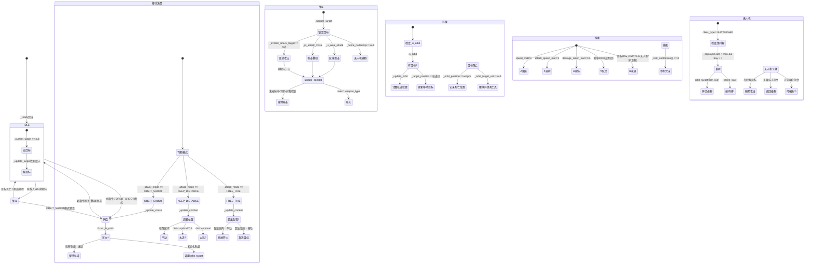

# Unit 状态机

## 一、状态变量总览

### 移动状态
| 变量 | 类型 | 说明 |
|------|------|------|
| `_is_moving` | bool | 是否正在向目标点移动 |
| `_target_position` | Vector2 | 当前移动目标位置 |
| `_is_attack_move` | bool | 攻击移动模式（A+点地） |
| `_is_area_attack` | bool | 区域攻击模式（A+点地未选中敌人） |
| `_attack_move_destination` | Vector2 | 攻击移动终点 |
| `_area_center` / `_area_radius` | Vector2/float | 区域攻击范围 |
| `_has_saved_move` / `_saved_move_target` | bool/Vector2 | 保存的移动目标（追击时临时保存） |

### 战斗状态
| 变量 | 类型 | 说明 |
|------|------|------|
| `_current_target` | Unit | 当前攻击目标 |
| `_explicit_attack_target` | Unit | 显式指定的攻击目标（右键/attack_target） |
| `_attack_mode` | AttackMode | 攻击模式：FREE_FIRE / KEEP_DISTANCE / ORBIT_SHOOT |
| `_slot_weapons[i]` | Weapon | 各槽位武器 |
| `_slot_cooldowns[i]` | float | 各槽位冷却 |
| `_slot_angles[i]` | float | 各炮塔角度 |

### 环绕状态
| 变量 | 类型 | 说明 |
|------|------|------|
| `_is_orbit` | bool | 是否在环绕 |
| `_orbit_target_unit` | Unit | 环绕目标单位 |
| `_orbit_position` | Vector2 | 环绕目标点（地面环绕用） |
| `_orbit_angle` | float | 环绕当前角度 |
| `_orbit_direction` | float | 环绕方向（1逆时针/-1顺时针） |
| `_orbit_radius` | float | 自定义环绕半径（-1时用默认） |

### Buff/技能状态
| 变量 | 类型 | 说明 |
|------|------|------|
| `_speed_mult` | float | 加速倍率（技能0，默认1.0） |
| `_attack_speed_mult` | float | 攻速倍率（技能1，默认1.0） |
| `_damage_taken_mult` | float | 受伤倍率（技能2，默认1.0） |
| `_slow_mult` | float | 目标减速倍率（技能4，默认1.0） |
| `_slow_timer` | float | 减速剩余时间 |
| `_skill_cooldowns[5]` | float[] | 各技能冷却 |
| `_skill_timers[5]` | float[] | 各技能效果剩余时间 |
| `_laser_cycle_timer` | float | 激光脉冲周期 |
| `_laser_attack_duration` | float | 激光攻击时长 |

### 无人机仓（战列舰专属）
| 变量 | 类型 | 说明 |
|------|------|------|
| `_drone_bay` | int | 舱内无人机数量 |
| `_deployed_drones` | Array[Unit] | 已部署无人机列表 |
| `_max_deployed_drones` | int | 最大同时部署数（4） |
| `_drone_launch_timer` | float | 发射间隔计时器 |
| `_home_battleship` | Unit | 无人机所属母舰 |

---

## 二、状态转换图



---

## 三、_process 执行优先级（按顺序）

| 优先级 | 函数 | 功能 | 条件 |
|:-----:|------|------|------|
| 1 | `_update_cooldowns` | 武器/技能冷却递减 | 总是执行 |
| 2 | `_update_skill_timers` | 技能效果到期检测 | 总是执行 |
| 3 | `_update_slow` | 减速效果到期检测 | 总是执行 |
| 4 | `_update_shield` | 护盾自动恢复 | 总是执行 |
| **5** | **`_update_target`** | **目标获取（核心决策）** | 总是执行 |
| 6 | `_update_turrets` | 炮塔旋转（视觉） | 总是执行 |
| **7** | **`_update_combat`** | **开火逻辑 + 机动攻击调整** | 总是执行 |
| **8** | **`_update_chase`** | **追击/环绕攻击决策** | 总是执行 |
| 9 | `_update_pd` | 近防炮拦截 | 有PD武器时 |
| **10** | **`_update_orbit`** | **环绕位置计算** | `_is_orbit == true` |
| 11 | `_update_drones` | 无人机发射（战列舰） | `class_type == BATTLESHIP` |
| **12** | **`_update_movement`** | **执行移动** | `_is_moving == true` |
| 13 | `queue_redraw` | 触发重绘 | 总是执行 |

---

## 四、关键转换条件

### 移动 → 停止
```
_is_moving = true → false 的条件:
  - 非攻击移动 && _current_target == null && 到达_target_position (dist < 4)
  - _is_attack_move && 到达终点 && 无目标
  - 显示调用 stop/move_to 等
```

### 无目标 → 有目标（_update_target 优先级从高到低）
```
1. _explicit_attack_target 有效          → 设为_current_target
2. _is_attack_move && 发现敌人            → 设为当前最近敌人
3. _is_area_attack && 区域内发现敌人       → 设为区域内最近敌人
4. (无人机) _home_battleship 有目标       → 辅助攻击母舰目标
5. (无人机) 无目标无指令                  → orbit_target(_home_battleship) 返回母舰
```

### 开火条件（_update_combat）
```
_current_target != null
&& target.hull > 0
&& dist <= w.range * _weapon_range_mult
&& _slot_cooldowns[i] <= 0
&& (w.type != LASER || laser_on)  // 激光受脉冲周期控制
```

### 环绕启动/停止
```
启动: orbit_target() / orbit_position() 被调用
  或: _attack_mode == ORBIT_SHOOT && 有攻击目标（_update_chase 自动触发）

停止: 任何移动/攻击指令（move_to / attack_target / stop）
  或: 目标死亡 && 无自定义 _orbit_position
```

---

## 五、攻击模式状态差异

| 特性 | FREE_FIRE | KEEP_DISTANCE | ORBIT_SHOOT |
|------|:---------:|:-------------:|:-----------:|
| 超出射程 | 移动到射程边缘 | 移动到 best×0.9 | 环绕中自然接近/远离 |
| 在射程内 | 原地开火 | 不动（死区80%~100%） | 环绕中开火 |
| 距离太近 | 不处理 | 远离到 best×0.9 | 环绕远离 |
| 触发函数 | `_update_chase`(默认) | `_update_combat` | `_update_chase` |
| 启动方式 | 默认/手动G切换 | 手动G切换 | 手动G切换 |

---

## 六、技能状态机

```
				+--冷却中--+                   
				|          |                   
		   CD>0 |          | CD=0              
				v          |                   
		 +--就绪--+--------+                   
		 |         触发                         
		 | 自动/手动                            
		 v                                     
   +--效果持续中--+                             
		 |                                     
	持续时间到期                                 
		 v                                     
   +--冷却中--+(SKILL_CD 后回到 就绪)            
```

减速技能特殊说明：
- 效果持续 10s，CD 10s，可无限续杯
- 多人对同一目标减速 = 乘法叠加：`slow_mult *= 0.5` 每次
- 同一目标的 `_slow_timer` 被刷新到 10s
